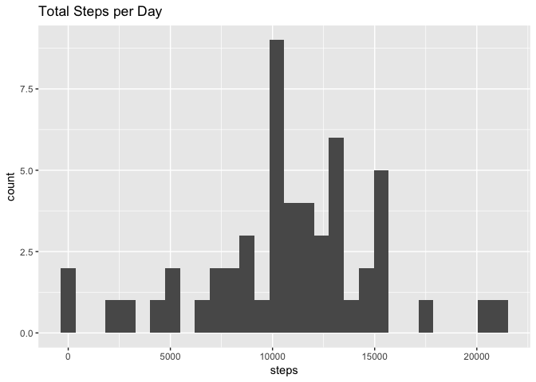
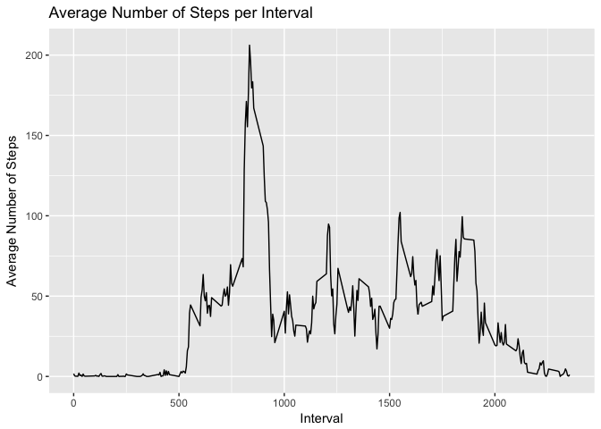
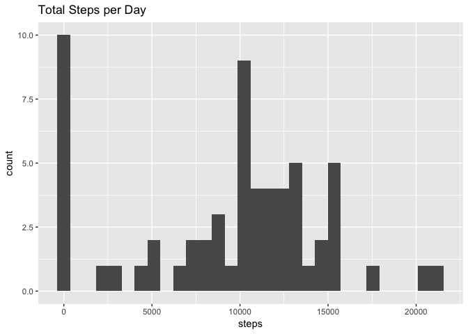
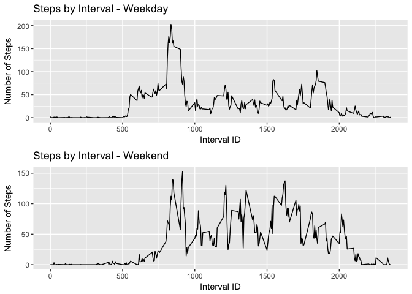

## Loading and preprocessing the data

```r
url <- "https://d396qusza40orc.cloudfront.net/repdata%2Fdata%2Factivity.zip"
download.file(url = url, "Activity_monitoring_data.zip")
unzip("Activity_monitoring_data.zip")
act.data <- read.csv(file = "activity.csv", header = TRUE, na.strings = NA)
```

After that, I converted the dates into the right format:

```r
act.data$date <- as.Date(act.data$date) # Convert data into a date format
act.data.ign <- subset(act.data, !is.na(act.data$steps))
```

## What is mean total number of steps taken per day?

```r
steps.per.day <- aggregate(steps ~ date, data = act.data, sum, na.rm = TRUE)

library(ggplot2)
c <- ggplot(data = steps.per.day, aes(steps))
c + geom_histogram() + ggtitle("Total Steps per Day")
```

```
## `stat_bin()` using `bins = 30`. Pick better value with `binwidth`.
```

<!-- -->

```r
mean_steps <- mean(steps.per.day$steps) # mean number of steps taken per day
median_steps <- median(steps.per.day$steps) # median total number of steps taken per day

paste("The mean of the total number of steps taken per day is", mean_steps, sep = " ")
```

```
## [1] "The mean of the total number of steps taken per day is 10766.1886792453"
```

```r
paste("The median of the total number of steps taken per day is", median_steps, sep = " ")
```

```
## [1] "The median of the total number of steps taken per day is 10765"
```

## What is the average daily activity pattern?

```r
stepsdata <- aggregate(steps ~ interval, data = act.data, mean, na.rm = TRUE)

library(ggplot2)
p <- ggplot(stepsdata, aes(x=interval, y=steps), xlab = "Interval", 
            ylab="Average Number of Steps")
p + geom_line() + xlab("Interval") + ylab("Average Number of Steps") + 
        ggtitle("Average Number of Steps per Interval")
```

<!-- -->

```r
print("The 5-minute interval, on average across all the days in the dataset, that contains the maximum number of steps")
```

```
## [1] "The 5-minute interval, on average across all the days in the dataset, that contains the maximum number of steps"
```

```r
stepsdata[stepsdata$steps == max(stepsdata$steps),]
```

```
##     interval    steps
## 104      835 206.1698
```


## Imputing missing values

```r
sum_na <- sum(is.na(act.data$steps))
paste("The total number of missing values in the dataset is", sum_na, sep = " ")
```

[1] "The total number of missing values in the dataset is 2304"

```r
clean.data <- act.data
clean.data$steps[is.na(clean.data$steps)] <- median(act.data$steps, na.rm=TRUE)
clean.data.day <- aggregate(steps ~ date, data=clean.data, sum, na.rm=TRUE)
p <- ggplot(data = clean.data.day, aes(steps))
p + geom_histogram() + ggtitle("Total Steps per Day")
```

```
## `stat_bin()` using `bins = 30`. Pick better value with `binwidth`.
```

<!-- -->

```r
mean_day <- mean(clean.data.day$steps)
median_day <- median(clean.data.day$steps)

paste("The mean of total number of steps taken per day is", mean_day, sep = " ")
```

[1] "The mean of total number of steps taken per day is 9354.22950819672"

```r
paste("The median of total number of steps taken per day is", median_day, sep = " ")
```

[1] "The median of total number of steps taken per day is 10395"

After imputing the missing values, the mean and the median are higher.

## Are there differences in activity patterns between weekdays and weekends?

```r
library(ggplot2)
library(gridExtra)

clean.data$date <- as.Date(clean.data$date)
clean.data$dayname <- weekdays(clean.data$date)
clean.data$weekend <- as.factor(ifelse(clean.data$dayname == "Saturday" | clean.data$dayname == "Sunday", "weekend", "weekday"))

clean.data.perday <- aggregate(steps ~ interval + weekend, data = clean.data, mean, na.rm = TRUE)

weekday <- ggplot(clean.data.perday[clean.data.perday$weekend == "weekday",], aes(interval, steps)) + 
        geom_line() + ggtitle("Steps by Interval - Weekday") + xlab("Interval ID") + 
        ylab("Number of Steps")

weekend <- ggplot(clean.data.perday[clean.data.perday$weekend == "weekend",], aes(interval, steps)) + 
        geom_line() + ggtitle("Steps by Interval - Weekend") + xlab("Interval ID") + 
        ylab("Number of Steps")

grid.arrange(weekday, weekend, nrow=2)
```

<!-- -->


## Session info

```r
sessionInfo()
```

```
## R version 3.4.3 (2017-11-30)
## Platform: x86_64-apple-darwin15.6.0 (64-bit)
## Running under: macOS High Sierra 10.13.2
## 
## Matrix products: default
## BLAS: /Library/Frameworks/R.framework/Versions/3.4/Resources/lib/libRblas.0.dylib
## LAPACK: /Library/Frameworks/R.framework/Versions/3.4/Resources/lib/libRlapack.dylib
## 
## locale:
## [1] en_US.UTF-8/en_US.UTF-8/en_US.UTF-8/C/en_US.UTF-8/en_US.UTF-8
## 
## attached base packages:
## [1] stats     graphics  grDevices utils     datasets  methods   base     
## 
## other attached packages:
## [1] gridExtra_2.3 ggplot2_2.2.1
## 
## loaded via a namespace (and not attached):
##  [1] Rcpp_0.12.15     digest_0.6.14    rprojroot_1.3-2  plyr_1.8.4      
##  [5] grid_3.4.3       gtable_0.2.0     backports_1.1.2  magrittr_1.5    
##  [9] evaluate_0.10.1  scales_0.5.0     pillar_1.1.0     rlang_0.1.6     
## [13] stringi_1.1.6    lazyeval_0.2.1   rmarkdown_1.8    labeling_0.3    
## [17] tools_3.4.3      stringr_1.2.0    munsell_0.4.3    yaml_2.1.16     
## [21] compiler_3.4.3   colorspace_1.3-2 htmltools_0.3.6  knitr_1.18      
## [25] tibble_1.4.2
```

